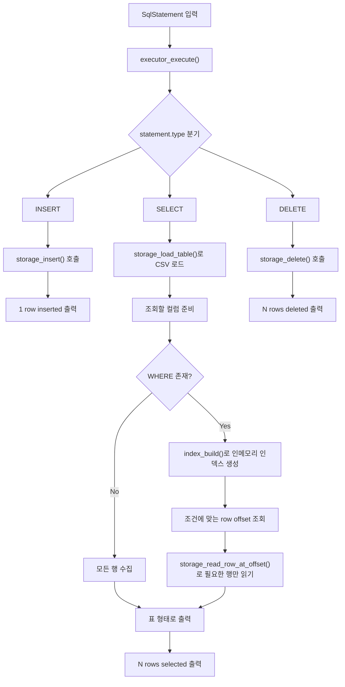

## 실행 엔진

아래 다이어그램은 `executor.c`가 파싱된 SQL 문을 받아
`INSERT`, `SELECT`, `DELETE`를 어떻게 실행하는지 보여준다.

```mermaid
flowchart TD
    A["SqlStatement 입력"] --> B["executor_execute()"]
    B --> C{"statement.type 분기"}

    C --> D["INSERT"]
    C --> E["SELECT"]
    C --> F["DELETE"]

    D --> G["storage_insert() 호출"]
    G --> H["1 row inserted 출력"]

    E --> I["storage_load_table()로 CSV 로드"]
    I --> J["조회할 컬럼 준비"]
    J --> K{"WHERE 존재?"}

    K -->|No| L["모든 행 수집"]
    K -->|Yes| M["index_build()로 인메모리 인덱스 생성"]
    M --> N["조건에 맞는 row offset 조회"]
    N --> O["storage_read_row_at_offset()로 필요한 행만 읽기"]

    L --> P["표 형태로 출력"]
    O --> P
    P --> Q["N rows selected 출력"]

    F --> R["storage_delete() 호출"]
    R --> S["N rows deleted 출력"]
```
