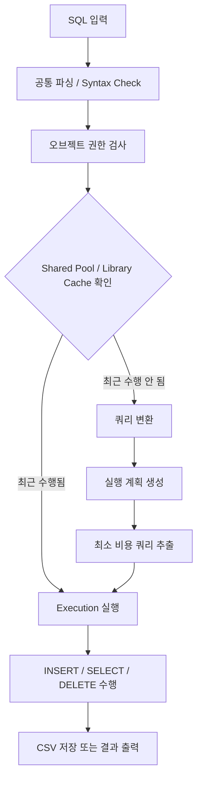

## 실행 엔진

아래 다이어그램은 우리 프로젝트가 SQL을 실행할 때 거치는 흐름을 보여준다.
`공통 파싱 / Syntax Check` 이후에는 `executor.c`가 권한 검사, library cache 확인,
쿼리 변환, 실행 계획 생성, 최소 비용 계획 선택을 순서대로 처리한다.

현재 구현은 교육용 경량 엔진이므로, 권한 검사는 객체 유효성/존재 확인 수준으로 단순화했고
library cache와 비용 기반 계획 선택도 프로세스 메모리 안에서 동작하는 축소판으로 구현했다.
