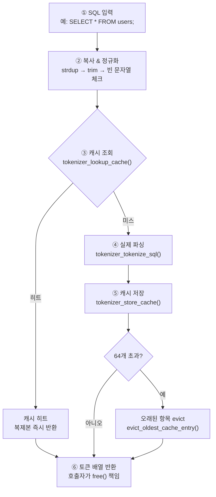
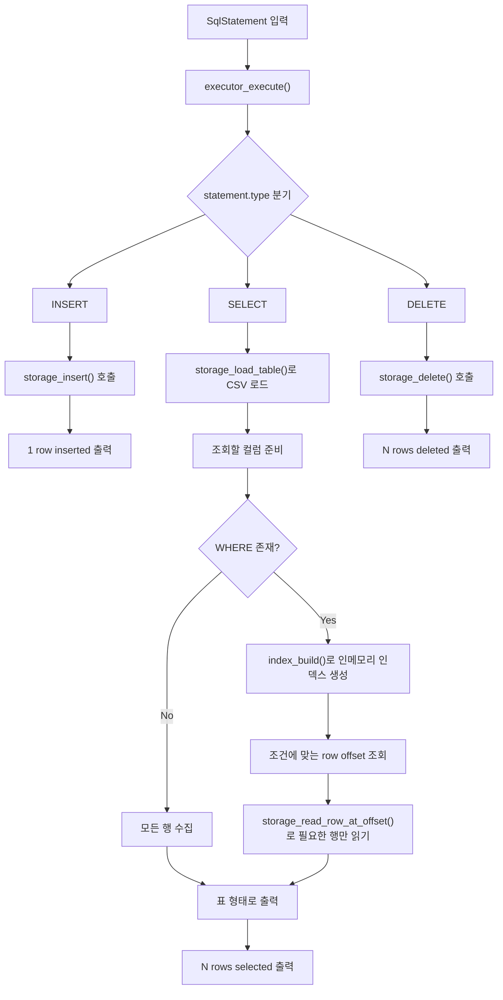

## 프로젝트 개요
이 프로젝트는 C 언어로 구현한 간단한 SQL 처리기(SQL Processor)입니다.
사용자로부터 SQL 쿼리를 입력받아 파싱하고, 이를 실행하여 CSV 파일 기반 저장소에 반영합니다.

## 전체 토크나이저 흐름 (tokenizer_tokenize 함수)

## 토큰 타입 분류 (tokenizer_tokenize_sql 내부 분기)

## 실행 엔진

아래 다이어그램은 `executor.c`가 파싱된 SQL 문을 받아
`INSERT`, `SELECT`, `DELETE`를 어떻게 실행하는지 보여준다.

## 테스트는 어떻게 했는지?

테스트는 네 단계로 나눴다.

| 분류 | 목적 |
| --- | --- |
| Unit Test | 토크나이저, 파서, 스토리지, 실행기 같은 모듈 단위 검증 |
| Integration Test | tokenizer -> parser -> executor -> storage가 연결돼서 잘 동작하는지 확인 |
| Functional Test | INSERT, SELECT, DELETE, WHERE 같은 실제 SQL 기능 검증 |
| Edge Case Test | 중복 PK, 문자열 내 수미표, 존재하지 않는 테이블, 빈 결과 같은 예외 상황 검증  |

## 수요 코딩회 작업 비중

## 최적화 요약

| 항목 |  설명 |
|------|----------|
| Tokenizer 캐시 | 동일 SQL 입력 시, 토큰화 결과를 캐시에서 재사용하여 문자열 → 토큰 변환 비용 감소 |
| 인덱스 기반 조회 | WHERE 조건 시, 인메모리 인덱스를 생성하여 조건에 맞는 row offset 탐색 |
| Offset 기반 파일 접근 | 전체 파일을 순회하지 않고, 필요한 행만 직접 읽어서 조회 |
